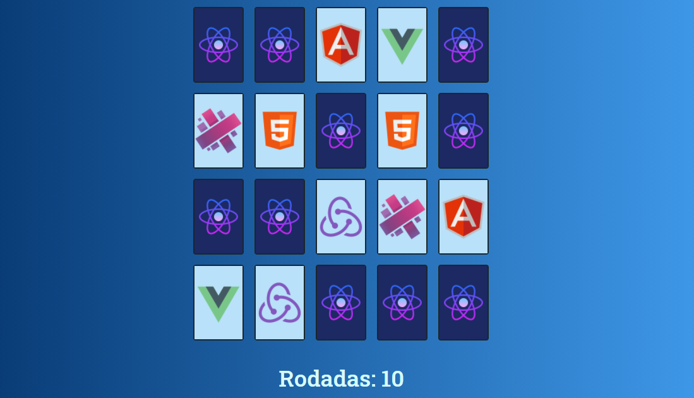

# Jogo de Memória

O jogo deve começar pedindo o nome do usuário.

Deve conter pelo menos 10 pares de cartas, que devem ser embaralhadas e dispostas em forma de grid com o conteúdo de cada uma delas de forma oculta.

A cada rodada, o usuário deverá escolher duas cartas que devem ser reveladas, verificando se elas formam um par. Caso formem, deve manter o par visível.

O sistema deve exibir um contador de rodadas, que começa em zero.

Ao encontrar todos os pares, o sistema exibe um ranking de quais usuários utilizaram menos rodadas para concluir.

## Preview

<p align="center">
  
</p>

## Tecnologias Utilizadas 🚀

React ⚛️ <br />
Styled-Components 💅🏻 <br />
Typescript 🦕

## :books: Guia de instalação e execução

### Pré-requisitos

- [Git](https://git-scm.com/)
- [Node.js](https://nodejs.org/en/) v10.20 ou maior
- [Yarn](https://yarnpkg.com/)

### Como executar

- Clone este repositório `git clone https://github.com/MayconRRibeiro/Memory-Game.git`
- Vá até o diretório `cd Memory-Game`
- Execute `yarn` para instalar as dependências
- Execute `yarn start` para rodar a aplicação

Pronto! Você pode visualizar o "Jogo de Memória" através do endereço http://localhost:3000

## Como Contribuir? 😍

**Faça um fork deste repositório**

```bash
# Clone o seu fork
$ git clone url-do-seu-fork && cd nome-do-projeto

# Crie uma branch com sua feature ou correção de bugs
$ git checkout -b minha-branch

# Faça o commit das suas alterações
$ git commit -m 'minhas alterações'

# Faça o push para a sua branch
$ git push origin minha-branch
```

Delete sua branch, se quiser, quando o merge da sua pull request for feito. <br />

Feito com 💜 por Maycon Renan Ribeiro dos Santos
